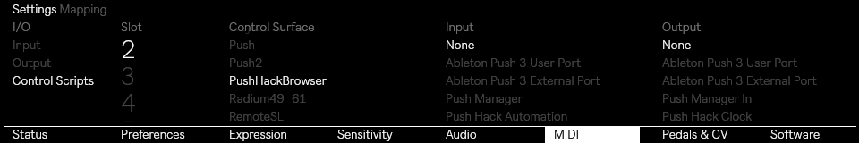

# Browser Bridge (`browser-bridge`)

Ableton Live **MIDI Remote Script** (`PushHackBrowser`) that loads `.adv`/`.adg` presets onto the
selected track via the Live browser API — the only way to instantiate a preset, since only Live's engine
can do it. Lets [push-manager](https://github.com/federico-pepe/ableton-push-hack)'s preset browser / Shadow UI act as a preset browser.

A push-hack module, installable via [Push Hack Catalog](https://github.com/federico-pepe/ableton-push-hack/tree/main/hacks/push-catalog).
Requires push-manager + push-display already installed — see the
[main framework repo](https://github.com/federico-pepe/ableton-push-hack).

> Why a remote script? D-Bus (`com.ableton.push3`) exposes no load channel, and MIDI-driving the native
> browser is fragile and can't target a preset by name. A custom control surface — the same mechanism
> ClyphX / AbleSet already use on this Push — runs inside Live with full Live Object Model access.

## How it works

```
Shadow UI / web UI ──HTTP──▶ push-manager ──TCP 127.0.0.1:7704──▶ PushHackBrowser (inside Live)
   (browse/search)            (src/live_bridge.go)                 └─▶ browser.load_item(item)
                                                                       onto song.view.selected_track
```

- **Browsing/search/filter happens in push-manager** from a filesystem scan, not in Live. The UI sends
  only the chosen preset's name + category to the bridge.
- **Loading happens in Live.** push-manager opens a one-shot TCP connection to `127.0.0.1:7704` and sends
  one command line; the script does the actual load.
- `remote-script/` — the Live script (`__init__.py` + `PushHackBrowser.py`). No binary — this hack has
  no long-running daemon of its own; the socket server runs inside Live once Live loads the script.

### Threading model (the core constraint)

The Live Object Model is single-threaded — every API call must run on Live's engine thread. So the script
splits work:

1. A **daemon socket thread** binds `127.0.0.1:7704`, accepts connections, and only **enqueues** commands
   (makes no Live API calls). Reply `OK` is an *enqueue ack*, not a load result.
2. `update_display()`, which the framework calls periodically **on the engine thread**, **drains the queue**
   and performs the loads. The true outcome lands in Live's `Log.txt`.

The socket, queue, and lock are **class-level singletons**. Live re-instantiates the surface several times
during startup; binding per-instance races ("Address already in use") and leaves a zombie listener whose
`update_display` is never pumped. One shared listener means whichever instance is active drains the commands.

## Commands (one line per TCP connection)

| Command | Effect |
|---|---|
| `load:<name>` | Find preset by name across all browser roots, load onto selected track |
| `load:<category>:<name>` | Scoped load — `category` ∈ `instruments` / `drums` / `audio_effects` / `midi_effects` / `samples` |
| `load_uri:<uri>` | Load by browser URI |
| `load_plugin:<plugin>` | Load a scanned VST3 plugin (default patch) onto the selected track. Needs the plugin scan flag on, see [vst3-on-push3](https://github.com/federico-pepe/ableton-push-hack/blob/main/docs/vst3-on-push3.md) |
| `load_plugin:<plugin>:<preset>` | Load one of the plugin's `.vstpreset` files (name without the extension is fine) |
| `list_plugins` | Reply-box query — one JSON line: `{"plugins":[{"vendor","name","presets":[...]}]}` |
| `dump:<root>[:<depth>]` | Debug: log a browser root's tree (name, loadable, URI) to `Log.txt`, e.g. `dump:plugins:3` |
| `load_sample:<name>` | Load a sample (searches `samples`, then `places`) |
| `ping` | Health check → `pong` in log |
| `play` / `stop` | Start / stop transport (fire-and-forget) |
| `get_tempo` / `get_beat` / `get_playing` | Reply-box queries — held connection answered from the engine thread (`"%.4f\n"` / `"%.6f\n"` / `1`\|`0`) |

## Plugins and presets

Push's own browser hides plugins, but Live's Browser API does not: `browser.plugins` is
`Plug-Ins > <Vendor> > <Plugin>`, and a plugin item is loadable. Tested with Surge XT on Push.

- A plugin's `.vstpreset` presets are the children of its plugin item. The file's header holds the
  plugin's class ID, which is how Live files each preset under the right plugin.
- Live only indexes a `.vstpreset` in the **User Library** (`/data/Music/Ableton/User Library/`). It was picked up
  in about 40 seconds with no restart. The same file in `~/.vst3/presets/<Vendor>/<Plugin>/` was never indexed.
- Several plugins can have a preset with the same name. Use `load_plugin:<plugin>:<preset>`, not a bare `load:<name>`.

## Name → BrowserItem resolution (the tricky part)

`browser.load_item()` takes a `BrowserItem`, not a filesystem path — so the script walks the browser tree
to find the item whose name matches. Notes for the next person:

- **Core Library presets are NOT under the device-centric `instruments` root** — they live under the
  browser's `sounds` / `drums` roots. Each category maps to *candidate* roots (`SCOPE_ROOTS`:
  instruments→`(sounds,instruments)`, drums→`(drums,sounds)`, …) with a full-search fallback on miss.
- **Presets nest under loadable *device* nodes**, which report `is_folder=False`
  (`instruments > Operator > Guitar & Plucked > "12 String Guitar"`) — the walk recurses into **any node
  with children**, not just folders. Bounded by `MAX_DEPTH=12` so a deep tree can't stall audio.
- **Some roots return a `BrowserItemVector`** (e.g. `sounds`, `user_folders`), not a single item —
  `_roots` expands those; only single `BrowserItem`s have `.children`.
- **Browser item names include the file extension** (`"12 String Guitar.adv"`); matching strips the
  extension (`LIVE_EXTS`) before comparing to the (stripped) name the index sends.

## Install

Via [Push Hack Catalog](https://github.com/federico-pepe/ableton-push-hack/tree/main/hacks/push-catalog) —
find "Browser Bridge" and install it. push-catalog copies `remote-script/` to
`/data/Music/Ableton/User Library/Remote Scripts/PushHackBrowser/` (chowned `ableton:users`); there is no
service to start, since the socket server runs inside Live itself once the script is enabled below.

## One-time manual activation (user-managed)

Same step that enables ClyphX / AbleSet on this Push. Requires Live 12.4 or later on Push.



1. Open **MIDI Preferences** on Push.
2. Use the top-left knob to select `Control Scripts`.
3. Select an empty slot.
4. Use the third knob to scroll through the **Control Surface** list, then select `PushHackBrowser`.
5. Leave *Input* and *Output* set to **None**.
6. Reboot Push for the setting to take effect.
7. Confirm `PushHackBrowser alive` + `listening on 127.0.0.1:7704` in
   `/data/.config/Ableton/Live <version>/Log.txt`.
8. Test: `printf 'ping' | nc 127.0.0.1 7704` → `pong` line in the log; then
   `printf 'load:<PresetName.adv>' | nc 127.0.0.1 7704` and watch it land on the selected track.

## Open item

`browser.load_item` takes a *BrowserItem*, not a filesystem path. The walk covers `user_library`,
`user_folders` ("Places"), and `current_project`. Confirm the lookup resolves real `/data` preset paths
on-device; worst case, only User-Library presets load initially.
